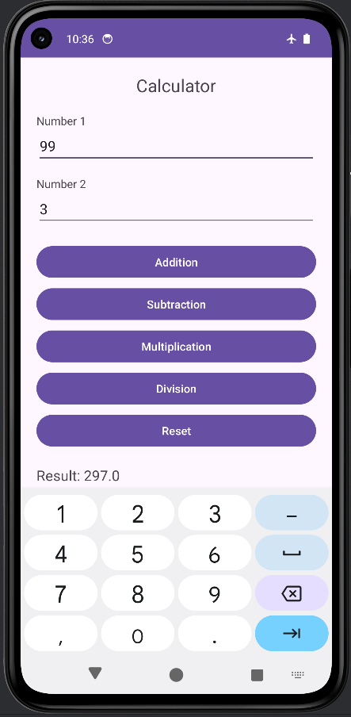

# Mobile Applications Collection

A collection of Android applications developed for mobile application development practice.

## Projects Included

### 1. Canvas (Prac_1)
A demonstration of custom drawing in Android using the `Canvas` class.
- **Features**: Draws lines, rectangles, circles, ovals, and custom text.
- **Key Components**: `Exam.java` (Custom View), `MainActivity.java`.

#### Screenshot

  

### 2. HelloWorld (App2)
A standard "Hello World" starter application.
- **Features**: Basic UI with a TextView.
- **Tech Stack**: Kotlin, XML Layouts.

#### Screenshot

  

### 3. Pictures (Prac3)
An automated image slideshow application.
- **Features**: Automatically cycles through images every 3 seconds.
- **Key Components**: `Handler`, `Runnable`, `ImageView`.

### 4. SumCalculator (App4)
A functional calculator for basic arithmetic.
- **Features**: Addition, Subtraction, Multiplication, and Division. Includes a reset functionality and input validation.
- **Key Components**: `EditText`, `Button`, `TextView`.

#### Screenshots

  
  
  

### 5. eXP5
A simple app demonstrating interactive UI elements.
- **Features**: Uses a `ToggleButton` to trigger `Toast` notifications.
- **Key Components**: `ToggleButton`, `OnCheckedChangeListener`.

## Getting Started
Each directory is an independent Android Studio project.
1. Open Android Studio.
2. Select **File > Open** and choose the directory of the app you want to explore.
3. Sync Gradle and run the project.
